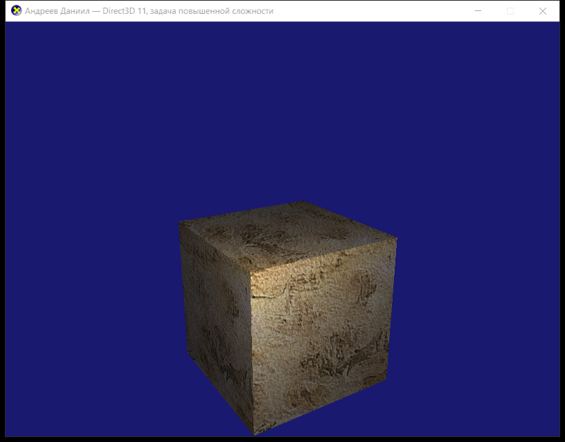

# Задача повышенной сложности — Direct3D 11

**Выполнил:** Андреев Даниил

## Задание

Внести изменения в `Tutorial07`: вращающийся текстурированный куб должен освещаться
точечным источником света **без спекулярной составляющей**.

База — пример `Tutorial07` из DirectX-SDK-Samples (`source/Direct3D/C++/Tutorial07`):
вращающийся текстурированный куб, загрузка `seafloor.dds` через `DDSTextureLoader`,
линейный сэмплер, три буфера констант. Освещения в исходном примере нет.

## Отличие от ЛР 5

В [lab-5](../lab-5/) точечный источник считается с зеркальной составляющей — на гранях
виден яркий блик, положение которого зависит от позиции камеры. Здесь зеркальной
составляющей нет: яркость точки определяется **только** текстурой, углом падения
света (`N · L`) и расстоянием до источника. Картинка не зависит от того, откуда
смотрит камера — нет ни блика, ни направления взгляда в формуле, поэтому и позиция
камеры (`vEyePos`) в буфер констант не передаётся.

## Внесённые изменения

### 1. Нормали в вершинах ([Extra.cpp](Extra.cpp))

В `Tutorial07` вершина состоит только из позиции и текстурных координат — освещение
считать нечем. Добавлена нормаль:

```cpp
struct SimpleVertex
{
    XMFLOAT3 Pos;
    XMFLOAT3 Normal;   // добавлено
    XMFLOAT2 Tex;
};
```

Все 24 вершины (по 4 на грань) получили нормаль своей грани, input layout расширен:

```cpp
{ "POSITION", 0, DXGI_FORMAT_R32G32B32_FLOAT, 0,  0, D3D11_INPUT_PER_VERTEX_DATA, 0 },
{ "NORMAL",   0, DXGI_FORMAT_R32G32B32_FLOAT, 0, 12, D3D11_INPUT_PER_VERTEX_DATA, 0 },
{ "TEXCOORD", 0, DXGI_FORMAT_R32G32_FLOAT,    0, 24, D3D11_INPUT_PER_VERTEX_DATA, 0 },
```

### 2. Точечный источник без спекуляра ([Extra.fx](Extra.fx))

```hlsl
float4 texColor = txDiffuse.Sample( samLinear, input.Tex ) * vMeshColor;

float3 N = normalize( input.Norm );
float3 toLight = vLightPos.xyz - input.PosW;   // вектор до источника
float  dist = length( toLight );               // расстояние до источника
float3 L = toLight / max( dist, 1e-5f );       // направление на источник

// затухание точечного источника с расстоянием
float att = 1.0f / ( vAttenuation.x + vAttenuation.y * dist + vAttenuation.z * dist * dist );

// только дефьюзная составляющая, зеркальной нет
float  NdotL = saturate( dot( N, L ) );
float4 diffuse = NdotL * att * vLightColor;

float4 finalColor = saturate( texColor * ( vAmbient + diffuse ) );
```

Было (Tutorial07): `return txDiffuse.Sample( samLinear, input.Tex ) * vMeshColor;`

`VS` теперь выводит мировую позицию точки `PosW` и повёрнутую нормаль
(`mul( float4( input.Norm, 0 ), World )`, `w = 0` — чтобы к нормали не добавлялся перенос).

Именно позиция источника (а не направление) делает свет точечным: для каждого пикселя
считается свой вектор `L` и своё расстояние `dist`, поэтому на плоской грани получается
световое пятно, плавно затухающее к краям.

### 3. Буфер констант `cbChangesEveryFrame`

| Поле | Назначение |
|---|---|
| `mWorld`, `vMeshColor` | были в Tutorial07 |
| `vLightPos` | позиция точечного источника |
| `vLightColor` | цвет и яркость источника |
| `vAmbient` | фоновая составляющая |
| `vAttenuation` | коэффициенты затухания `1 / (x + y·d + z·d²)` |

Параметры сцены (константы в начале [Extra.cpp](Extra.cpp)):

```cpp
static const XMFLOAT4 g_LightPos    = XMFLOAT4( 0.0f, 1.8f, -2.8f, 1.0f );
static const XMFLOAT4 g_LightColor  = XMFLOAT4( 1.9f, 1.8f, 1.6f, 1.0f );
static const XMFLOAT4 g_Attenuation = XMFLOAT4( 1.0f, 0.10f, 0.22f, 0.0f );
static const XMFLOAT4 g_Ambient     = XMFLOAT4( 0.16f, 0.16f, 0.20f, 1.0f );
```

Источник неподвижен и стоит между камерой и кубом, чуть выше центра; куб вращается
(`g_World = XMMatrixRotationY( t )` — без изменений), поэтому световое пятно скользит
по граням. Яркость задана с запасом — часть съедает затухание.

Дополнительно: убрана анимация `vMeshColor` (в Tutorial07 цвет куба переливался
по синусам) — она мешала бы оценить освещение; в заголовок окна вынесено ФИО; имя
файла шейдера изменено с `Tutorial07.fx` на `Extra.fx`.

## Сборка и запуск

Visual Studio (2019/2022): открыть `Extra.sln`, конфигурация `Release|x64`.

Из командной строки:

```
MSBuild.exe Extra.sln /p:Configuration=Release /p:Platform=x64
```

Результат: `build\x64\Release\Extra.exe`.

Шейдер компилируется во время выполнения, текстура грузится из файла, поэтому цель
`CopyAssetsToOutput` копирует `Extra.fx` и `seafloor.dds` рядом с exe после сборки;
для запуска из VS задан `LocalDebuggerWorkingDirectory` = каталог проекта.

## Результат

Мягкое световое пятно на гранях, плавное затухание к краям и рёбрам, блика нет —
поверхность выглядит матовой.



## Файлы

- [Extra.cpp](Extra.cpp) — исходный код приложения
- [Extra.fx](Extra.fx) — вершинный и пиксельный шейдеры
- [DDSTextureLoader.cpp](DDSTextureLoader.cpp), [DDSTextureLoader.h](DDSTextureLoader.h) — загрузчик DDS-текстур (из примера)
- `seafloor.dds` — текстура куба
- [Extra.rc](Extra.rc), [Resource.h](Resource.h), `directx.ico` — ресурсы
- [Extra.vcxproj](Extra.vcxproj), [Extra.sln](Extra.sln) — проект и решение
- `screenshot.png` — скриншот работающего приложения
