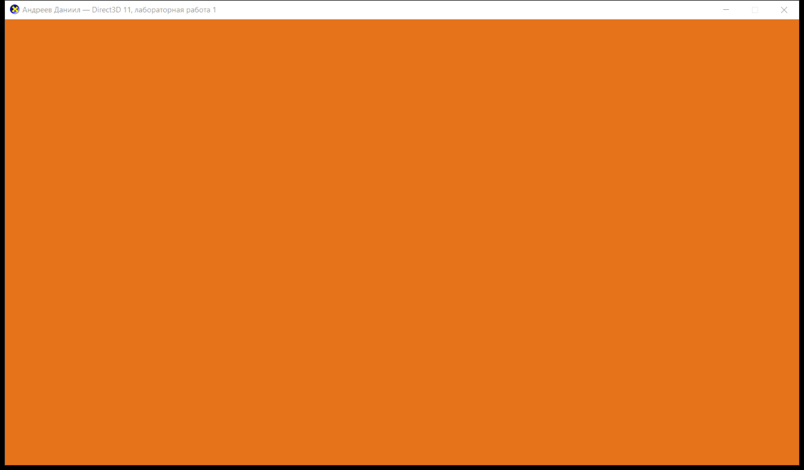

# Лабораторная работа 1 — Direct3D 11

**Выполнил:** Андреев Даниил

База — пример `Tutorial01` из DirectX-SDK-Samples (`source/Direct3D/C++/Tutorial01`):
создание устройства Direct3D 11, цепочки обмена (swap chain) и render target view,
очистка заднего буфера в цикле рендера.

## Задание

Внести в `Tutorial01` изменения:

1. в заголовке окна — ФИО;
2. изменить размер и цвет окна.

## Внесённые изменения ([Lab1.cpp](Lab1.cpp))

| Что | Было (Tutorial01) | Стало |
|---|---|---|
| Заголовок окна | `L"Direct3D 11 Tutorial 1: Direct3D 11 Basics"` | `WINDOW_TITLE` = `L"Андреев Даниил — Direct3D 11, лабораторная работа 1"` |
| Размер клиентской области | `RECT rc = { 0, 0, 800, 600 }` | `WINDOW_WIDTH` x `WINDOW_HEIGHT` = 1280 x 720 |
| Цвет заливки кадра | `Colors::MidnightBlue` | `g_ClearColor` = RGBA (0.9, 0.45, 0.1, 1.0) — оранжевый |
| Фоновая кисть класса окна | `(HBRUSH)(COLOR_WINDOW + 1)` | `CreateSolidBrush(RGB(230, 115, 25))` |

Параметры вынесены в блок констант в начале файла (после `using namespace DirectX;`),
цвет кадра задаётся массивом `FLOAT[4]` и передаётся в `ClearRenderTargetView`
вместо предопределённого цвета из `directxcolors.h`.

Размер окна задаётся для клиентской области: `AdjustWindowRect` пересчитывает
прямоугольник с учётом рамки и заголовка, поэтому внешний размер окна больше
(1296 x 759 на текущей системе), а backbuffer и viewport берут размер из
`GetClientRect` в `InitDevice()` и равны ровно 1280 x 720.

## Сборка

Visual Studio (2019/2022): открыть `Lab1.sln`, конфигурация `Release|x64`.

Из командной строки:

```
MSBuild.exe Lab1.sln /p:Configuration=Release /p:Platform=x64
```

Результат: `build\x64\Release\Lab1.exe`.

Проект использует набор инструментов v143 (VS2022) либо v142 (VS2019) — выбирается
автоматически, `WindowsTargetPlatformVersion` = последняя установленная версия Windows SDK.
Ключ `/utf-8` включён, так как исходник содержит кириллицу.

## Результат



## Файлы

- [Lab1.cpp](Lab1.cpp) — исходный код приложения
- [Lab1.rc](Lab1.rc), [Resource.h](Resource.h), `directx.ico` — ресурсы
- [Lab1.vcxproj](Lab1.vcxproj), [Lab1.sln](Lab1.sln) — проект и решение
- `screenshot.png` — скриншот работающего приложения
