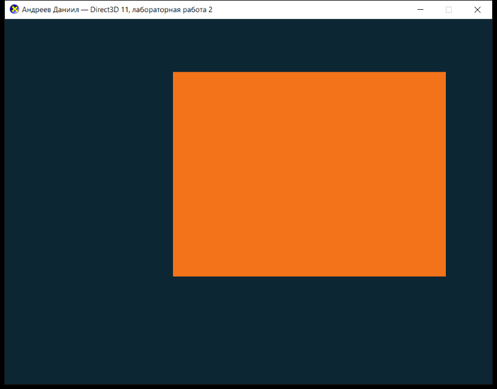

# Лабораторная работа 2 — Direct3D 11

**Выполнил:** Андреев Даниил

База — пример `Tutorial02` из DirectX-SDK-Samples (`source/Direct3D/C++/Tutorial02`):
вывод треугольника — вершинный буфер, вершинный и пиксельный шейдеры,
компиляция шейдеров из файла во время выполнения (`D3DCompileFromFile`).

## Задание

Внести в `Tutorial02` изменения:

1. треугольник заменить на четырёхугольник;
2. сдвинуть его и изменить размер (в вершинном шейдере);
3. изменить его цвет.

## Внесённые изменения

### 1. Четырёхугольник вместо треугольника ([Lab2.cpp](Lab2.cpp))

Вершинный буфер: 3 вершины → 4 вершины (углы квадрата ±0.4 в NDC).
Добавлен индексный буфер: четырёхугольник собирается из двух треугольников.

| | Было (Tutorial02) | Стало |
|---|---|---|
| Вершины | 3 (`XMFLOAT3(0, 0.5, 0.5)` и др.) | 4 угла: `(-0.4, 0.4)`, `(0.4, 0.4)`, `(0.4, -0.4)`, `(-0.4, -0.4)` |
| Индексный буфер | отсутствует | `WORD indices[] = { 0,1,2,  0,2,3 }`, `DXGI_FORMAT_R16_UINT` |
| Вызов отрисовки | `Draw( 3, 0 )` | `DrawIndexed( 6, 0, 0 )` |

Добавлен глобальный `g_pIndexBuffer`, его создание (`D3D11_BIND_INDEX_BUFFER`),
привязка `IASetIndexBuffer` и освобождение в `CleanupDevice()`.
Топология осталась `D3D11_PRIMITIVE_TOPOLOGY_TRIANGLELIST`.

### 2. Сдвиг и размер — в вершинном шейдере ([Lab2.fx](Lab2.fx))

```hlsl
static const float3 QUAD_SCALE  = float3( 1.4f, 1.4f, 1.0f );
static const float3 QUAD_OFFSET = float3( 0.25f, 0.15f, 0.0f );

float4 VS( float4 Pos : POSITION ) : SV_POSITION
{
    float3 p = Pos.xyz * QUAD_SCALE + QUAD_OFFSET;
    return float4( p, 1.0f );
}
```

Было: `return Pos;` — вершины выводились без преобразования.
Стало: масштаб 1.4 (сторона 0.8 → 1.12 в NDC) и сдвиг вправо-вверх на (0.25, 0.15).
Сами вершины в буфере не менялись — преобразование целиком в шейдере, как требует задание.

### 3. Цвет

| | Было | Стало |
|---|---|---|
| Цвет фигуры (PS) | `float4(1, 1, 0, 1)` — жёлтый | `QUAD_COLOR = float4(0.95, 0.45, 0.1, 1)` — оранжевый |
| Цвет фона (`ClearRenderTargetView`) | `Colors::MidnightBlue` | `g_ClearColor = { 0.05, 0.15, 0.2, 1 }` — тёмно-бирюзовый |

Дополнительно: в заголовок окна вынесено ФИО (`WINDOW_TITLE`), имя файла шейдера
изменено с `Tutorial02.fx` на `Lab2.fx`.

Четырёхугольник на экране выглядит прямоугольником, а не квадратом: координаты NDC
растягиваются на всё окно 800x600, поэтому квадрат в NDC получает пропорции окна 4:3.

## Сборка и запуск

Visual Studio (2019/2022): открыть `Lab2.sln`, конфигурация `Release|x64`.

Из командной строки:

```
MSBuild.exe Lab2.sln /p:Configuration=Release /p:Platform=x64
```

Результат: `build\x64\Release\Lab2.exe`.

Шейдер компилируется во время выполнения, поэтому `Lab2.fx` должен лежать в рабочем
каталоге приложения. В проекте есть цель `CopyShaderToOutput`, копирующая `Lab2.fx`
рядом с exe после сборки; для запуска из VS задан `LocalDebuggerWorkingDirectory` =
каталог проекта.

## Результат



## Файлы

- [Lab2.cpp](Lab2.cpp) — исходный код приложения
- [Lab2.fx](Lab2.fx) — вершинный и пиксельный шейдеры
- [Lab2.rc](Lab2.rc), [Resource.h](Resource.h), `directx.ico` — ресурсы
- [Lab2.vcxproj](Lab2.vcxproj), [Lab2.sln](Lab2.sln) — проект и решение
- `screenshot.png` — скриншот работающего приложения
