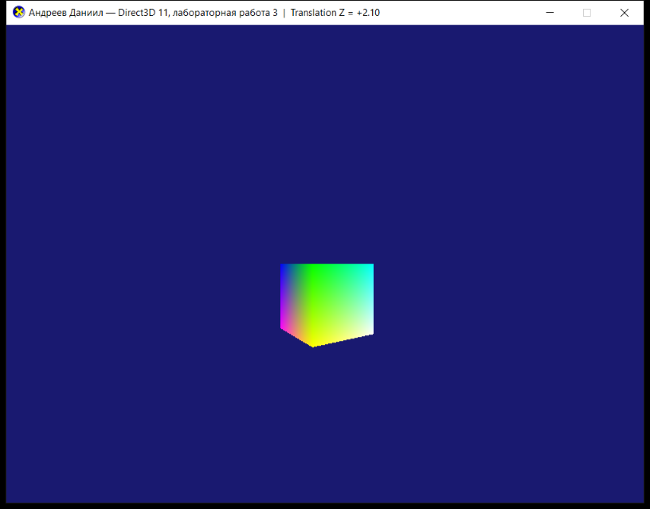
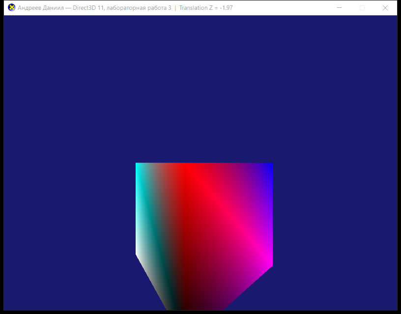

# Лабораторная работа 3 — Direct3D 11

**Выполнил:** Андреев Даниил

База — пример `Tutorial04` из DirectX-SDK-Samples (`source/Direct3D/C++/Tutorial04`):
цветной куб (8 вершин + индексный буфер на 36 индексов), буфер констант с матрицами
`World` / `View` / `Projection`, вращение вокруг оси Y в `Render()`.

## Задание

Внести в `Tutorial04` изменения:

1. добавить перемещение объекта по оси Z путём добавления в буфер констант матрицы
   Translation;
2. сделать это перемещение циклическим (sin).

## Внесённые изменения ([Lab3.cpp](Lab3.cpp))

### Матрица перемещения

Добавлена глобальная матрица `g_Translation` (рядом с `g_World`, `g_View`,
`g_Projection`), инициализируется единичной в `InitDevice()`.

Каждый кадр в `Render()`:

```cpp
const float z = TRANSLATE_AMPLITUDE * sinf( TRANSLATE_SPEED * t );
g_Translation = XMMatrixTranslation( 0.0f, 0.0f, z );
// сначала поворот вокруг собственной оси, затем перенос вдоль Z
g_World = XMMatrixRotationY( t ) * g_Translation;
```

Было: `g_World = XMMatrixRotationY( t );`

Матрица перемещения попадает в буфер констант как часть мировой матрицы — в `cb.mWorld`,
которая транспонируется и отправляется в `UpdateSubresource`. Шейдер [Lab3.fx](Lab3.fx)
не изменялся: он по-прежнему умножает позицию на `World`, `View`, `Projection`.

Порядок умножения важен: `Rotation * Translation` — куб крутится вокруг своей оси и
при этом целиком уезжает вдоль Z. При обратном порядке (`Translation * Rotation`) куб
вращался бы вокруг начала координат по орбите.

### Циклическое перемещение

Параметры вынесены в константы в начале файла:

```cpp
static const float TRANSLATE_AMPLITUDE = 2.5f;   // размах смещения по Z
static const float TRANSLATE_SPEED     = 1.0f;   // угловая частота, рад/с
```

`z(t) = 2.5 * sin(t)` — период 2π ≈ 6.3 с, куб циклически уходит от камеры
(z = +2.5) и возвращается к ней (z = −2.5). Камера стоит в точке (0, 1, −5) и смотрит
в начало координат, поэтому при z < 0 куб виден крупно, при z > 0 — мелко.

### Вспомогательное

- в заголовок окна вынесено ФИО (`WINDOW_TITLE`), туда же выводится текущее значение
  `Translation Z` — чтобы на отчётных скриншотах было видно смещение;
- добавлен `#include <stdio.h>` (для `swprintf_s`);
- имя файла шейдера изменено с `Tutorial04.fx` на `Lab3.fx`.

## Сборка и запуск

Visual Studio (2019/2022): открыть `Lab3.sln`, конфигурация `Release|x64`.

Из командной строки:

```
MSBuild.exe Lab3.sln /p:Configuration=Release /p:Platform=x64
```

Результат: `build\x64\Release\Lab3.exe`.

Шейдер компилируется во время выполнения, поэтому `Lab3.fx` должен лежать в рабочем
каталоге приложения; цель `CopyShaderToOutput` копирует его рядом с exe после сборки.

## Результат

Два скриншота при разных значениях перемещения (значение Z видно в заголовке окна).

Куб удалён от камеры, `Translation Z = +2.10`:



Куб приближен к камере, `Translation Z = −1.97`:



Нижняя грань выглядит «срезанной» — это особенность исходного `Tutorial04`: в нём нет
буфера глубины (он появляется только в `Tutorial05`), поэтому грани перекрывают друг
друга в порядке отрисовки, а не по глубине.

## Файлы

- [Lab3.cpp](Lab3.cpp) — исходный код приложения
- [Lab3.fx](Lab3.fx) — вершинный и пиксельный шейдеры
- [Lab3.rc](Lab3.rc), [Resource.h](Resource.h), `directx.ico` — ресурсы
- [Lab3.vcxproj](Lab3.vcxproj), [Lab3.sln](Lab3.sln) — проект и решение
- `screenshot-far.png`, `screenshot-near.png` — скриншоты при разных перемещениях
