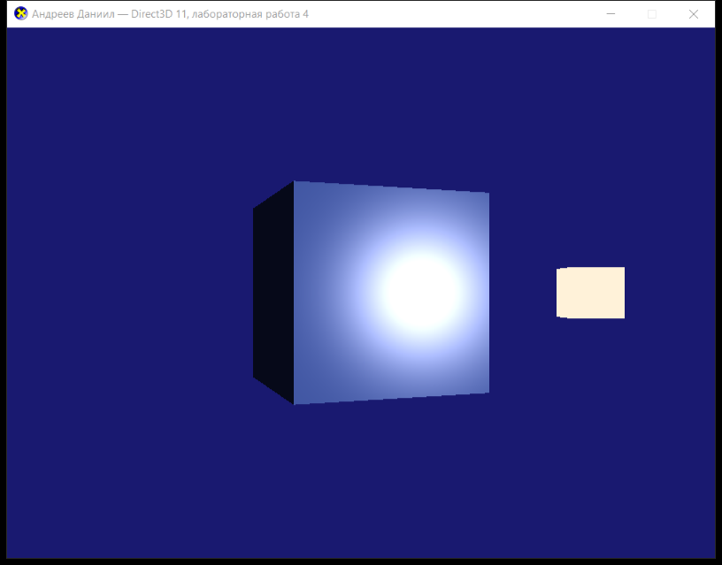

# Лабораторная работа 4 — Direct3D 11

**Выполнил:** Андреев Даниил

База — пример `Tutorial06` из DirectX-SDK-Samples (`source/Direct3D/C++/Tutorial06`):
вращающийся куб с нормалями на гранях, буфер глубины, два направленных источника
света (один неподвижный, второй вращается) и освещение только по закону Ламберта
(`N dot L`).

## Задание

Внести в `Tutorial06` изменения: вращающийся куб должен освещаться источником света
с дефьюзной и спекулярной составляющими.

Учтены подсказки из методички: убрать вращающийся источник света; неподвижный источник
должен светить под углом 45° к направлению камеры и иметь спекулярную составляющую;
придвинуть источник света и камеру к кубу; камеру расположить на оси Z; спекуляр
считать через `reflect`.

## Внесённые изменения

### 1. Модель освещения ([Lab4.fx](Lab4.fx))

Было (Tutorial06) — только дефьюзная составляющая для двух источников:

```hlsl
for( int i = 0; i < 2; i++ )
    finalColor += saturate( dot( (float3)vLightDir[i], input.Norm ) * vLightColor[i] );
```

Стало — модель Фонга: фоновая + дефьюзная + зеркальная составляющие для одного
источника:

```hlsl
float3 N = normalize( input.Norm );                  // нормаль
float3 L = normalize( (float3)vLightDir );           // направление на источник
float3 V = normalize( vEyePos.xyz - input.PosW );    // направление на камеру
float3 R = reflect( -L, N );                         // отражённый луч

float4 ambient  = vAmbient * vDiffuse;
float  NdotL    = saturate( dot( N, L ) );
float4 diffuse  = NdotL * vDiffuse * vLightColor;

float  RdotV    = max( 0.0f, dot( R, V ) );
float4 specular = pow( RdotV, vSpecular.w ) * float4( vSpecular.rgb, 0.0f ) * vLightColor;
specular *= ( NdotL > 0.0f ) ? 1.0f : 0.0f;          // блик только на освещённой стороне

float4 finalColor = saturate( ambient + diffuse + specular );
```

В `VS` добавлен вывод мировой позиции точки `PosW` — без неё нельзя посчитать
направление на камеру. Нормаль теперь умножается на `World` с `w = 0`
(было `w = 1`), чтобы к вектору нормали не добавлялся перенос.

### 2. Буфер констант ([Lab4.cpp](Lab4.cpp))

| Поле | Назначение |
|---|---|
| `vLightDir`, `vLightColor` | были массивами `[2]`, стали одиночными — источник один |
| `vEyePos` | позиция камеры в мировых координатах (для спекуляра) |
| `vAmbient` | фоновая составляющая |
| `vDiffuse` | собственный цвет материала куба |
| `vSpecular` | `rgb` — цвет блика, `w` — степень блеска (150) |

Параметры собраны в константы в начале файла: `g_Ambient`, `g_Diffuse`, `g_Specular`,
`g_LightDir`, `g_LightColor`, `g_EyePosInit`.

### 3. Сцена

| | Было (Tutorial06) | Стало |
|---|---|---|
| Камера | `Eye = (0, 4, -10)`, взгляд в `(0, 1, 0)` | `Eye = (0, 0, -7)` — на оси Z, взгляд в начало координат |
| Источники | два: неподвижный `(-0.577, 0.577, -0.577)` и красный вращающийся | один неподвижный `(0.707, 0, -0.707)` |
| Маркер источника | два куба на расстоянии 5.0 | один куб на расстоянии 2.6 |

Направление на источник `(0.707, 0, -0.707)` составляет ровно 45° с направлением
от куба на камеру `(0, 0, -1)`: `cos 45° = 0.707`.

Вращение куба (`g_World = XMMatrixRotationY( t )`) осталось без изменений — блик
пробегает по граням по мере поворота.

Дополнительно: в заголовок окна вынесено ФИО, имя файла шейдера изменено с
`Tutorial06.fx` на `Lab4.fx`.

## Сборка и запуск

Visual Studio (2019/2022): открыть `Lab4.sln`, конфигурация `Release|x64`.

Из командной строки:

```
MSBuild.exe Lab4.sln /p:Configuration=Release /p:Platform=x64
```

Результат: `build\x64\Release\Lab4.exe`.

Шейдер компилируется во время выполнения, поэтому `Lab4.fx` должен лежать в рабочем
каталоге приложения; цель `CopyShaderToOutput` копирует его рядом с exe после сборки.

## Результат

Видны все три составляющие: тёмная неосвещённая грань слева (только ambient),
плавная дефьюзная градация на правой грани и компактный белый блик от спекулярной
составляющей. Светлый кубик справа — маркер положения источника света.



## Файлы

- [Lab4.cpp](Lab4.cpp) — исходный код приложения
- [Lab4.fx](Lab4.fx) — вершинный и пиксельный шейдеры
- [Lab4.rc](Lab4.rc), [Resource.h](Resource.h), `directx.ico` — ресурсы
- [Lab4.vcxproj](Lab4.vcxproj), [Lab4.sln](Lab4.sln) — проект и решение
- `screenshot.png` — скриншот работающего приложения
