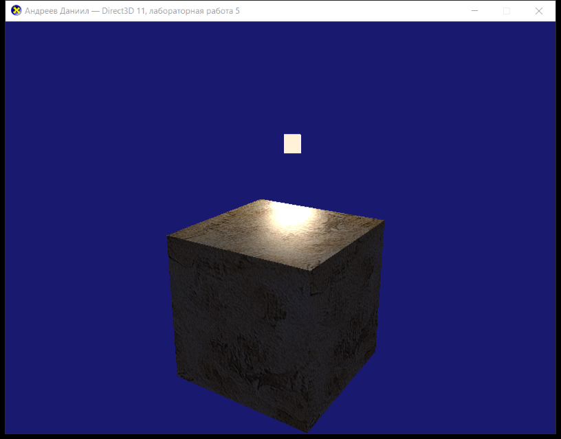
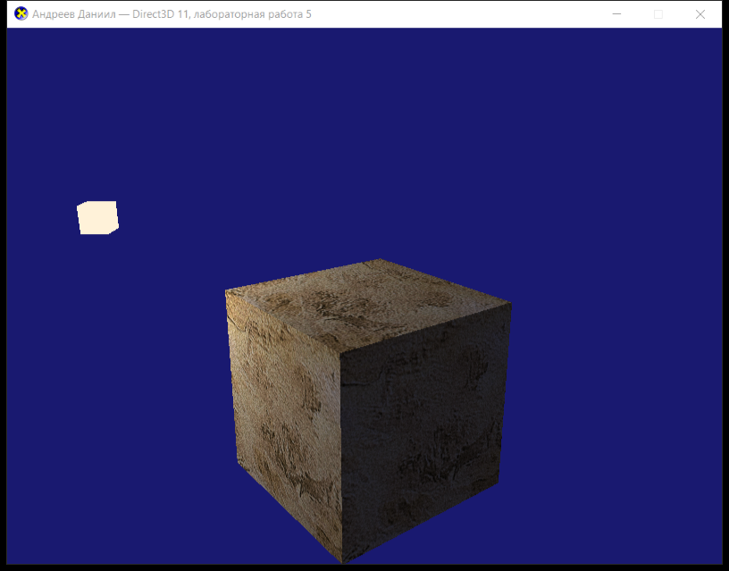

# Лабораторная работа 5 — Direct3D 11

**Выполнил:** Андреев Даниил

База — пример `Tutorial07` из DirectX-SDK-Samples (`source/Direct3D/C++/Tutorial07`):
вращающийся текстурированный куб, загрузка текстуры `seafloor.dds` через
`DDSTextureLoader`, линейный сэмплер, три буфера констант (`cbNeverChanges`,
`cbChangeOnResize`, `cbChangesEveryFrame`). Освещения в исходном примере нет.

## Задание

Внести в `Tutorial07` изменения: вращающийся текстурированный куб должен освещаться
точечным источником света.

## Внесённые изменения

### 1. Нормали в вершинах ([Lab5.cpp](Lab5.cpp))

В `Tutorial07` вершина состоит только из позиции и текстурных координат, поэтому
считать освещение было нечем. Добавлена нормаль:

```cpp
struct SimpleVertex
{
    XMFLOAT3 Pos;
    XMFLOAT3 Normal;   // добавлено
    XMFLOAT2 Tex;
};
```

Все 24 вершины (по 4 на грань) получили нормаль своей грани, input layout расширен:

```cpp
{ "POSITION", 0, DXGI_FORMAT_R32G32B32_FLOAT, 0,  0, D3D11_INPUT_PER_VERTEX_DATA, 0 },
{ "NORMAL",   0, DXGI_FORMAT_R32G32B32_FLOAT, 0, 12, D3D11_INPUT_PER_VERTEX_DATA, 0 },
{ "TEXCOORD", 0, DXGI_FORMAT_R32G32_FLOAT,    0, 24, D3D11_INPUT_PER_VERTEX_DATA, 0 },
```

### 2. Точечный источник света ([Lab5.fx](Lab5.fx))

Отличие точечного источника от направленного: в буфер констант передаётся **позиция**
источника, направление на свет считается для каждой точки поверхности, и добавляется
затухание с расстоянием.

```hlsl
float3 toLight = vLightPos.xyz - input.PosW;      // вектор до источника
float  dist    = length( toLight );               // расстояние
float3 L       = toLight / max( dist, 1e-5f );    // направление на источник
float3 V       = normalize( vEyePos.xyz - input.PosW );
float3 R       = reflect( -L, N );

// затухание точечного источника
float att = 1.0f / ( vAttenuation.x + vAttenuation.y * dist + vAttenuation.z * dist * dist );

float  NdotL    = saturate( dot( N, L ) );
float4 diffuse  = NdotL * att * vLightColor;

float  RdotV    = max( 0.0f, dot( R, V ) );
float4 specular = pow( RdotV, vSpecular.w ) * att * float4( vSpecular.rgb, 0.0f ) * vLightColor;
specular *= ( NdotL > 0.0f ) ? 1.0f : 0.0f;

// текстура модулируется фоновой и дефьюзной составляющими, блик добавляется сверху
float4 finalColor = saturate( texColor * ( vAmbient + diffuse ) + specular );
```

Было (Tutorial07): `return txDiffuse.Sample( samLinear, input.Tex ) * vMeshColor;`

`VS` теперь выводит мировую позицию точки `PosW` и повёрнутую нормаль
(`mul( float4( input.Norm, 0 ), World )`, `w = 0` — чтобы к нормали не добавлялся перенос).

### 3. Буфер констант `cbChangesEveryFrame`

| Поле | Назначение |
|---|---|
| `mWorld`, `vMeshColor` | были в Tutorial07 |
| `vLightPos` | позиция точечного источника |
| `vLightColor` | цвет и яркость источника |
| `vEyePos` | позиция камеры (для спекуляра) |
| `vAmbient` | фоновая составляющая |
| `vSpecular` | `rgb` — цвет блика, `w` — степень блеска (60) |
| `vAttenuation` | коэффициенты затухания `1 / (x + y·d + z·d²)` |

Яркость источника задана с запасом — `(2.4, 2.2, 1.9)`: часть съедает затухание
на расстоянии до грани.

### 4. Сцена ([Lab5.cpp](Lab5.cpp))

- источник света движется по окружности радиуса 3.0 вокруг куба на высоте 1.6
  (`g_LightRadius`, `g_LightHeight`, `g_LightSpeed`) — так видно, что источник
  именно точечный: освещённая область перемещается по граням;
- положение источника показано маленьким светлым кубиком — для него добавлен
  пиксельный шейдер `PSSolid` и второй вызов `DrawIndexed`;
- убрана анимация `vMeshColor` (в Tutorial07 цвет куба переливался по синусам) —
  она мешала бы оценить освещение, цвет зафиксирован белым;
- вращение куба `g_World = XMMatrixRotationY( t )` оставлено без изменений;
- в заголовок окна вынесено ФИО, имя файла шейдера изменено с `Tutorial07.fx` на `Lab5.fx`.

## Сборка и запуск

Visual Studio (2019/2022): открыть `Lab5.sln`, конфигурация `Release|x64`.

Из командной строки:

```
MSBuild.exe Lab5.sln /p:Configuration=Release /p:Platform=x64
```

Результат: `build\x64\Release\Lab5.exe`.

Шейдер компилируется во время выполнения, текстура грузится из файла, поэтому цель
`CopyAssetsToOutput` копирует `Lab5.fx` и `seafloor.dds` рядом с exe после сборки;
для запуска из VS задан `LocalDebuggerWorkingDirectory` = каталог проекта.

## Результат

Источник над кубом — на верхней грани виден зеркальный блик, боковые грани уходят
в тень:



Источник слева — освещена левая грань, правая почти не освещена (видна только
фоновая составляющая):



## Файлы

- [Lab5.cpp](Lab5.cpp) — исходный код приложения
- [Lab5.fx](Lab5.fx) — вершинный и пиксельные шейдеры
- [DDSTextureLoader.cpp](DDSTextureLoader.cpp), [DDSTextureLoader.h](DDSTextureLoader.h) — загрузчик DDS-текстур (из примера)
- `seafloor.dds` — текстура куба
- [Lab5.rc](Lab5.rc), [Resource.h](Resource.h), `directx.ico` — ресурсы
- [Lab5.vcxproj](Lab5.vcxproj), [Lab5.sln](Lab5.sln) — проект и решение
- `screenshot.png`, `screenshot-2.png` — скриншоты работающего приложения
